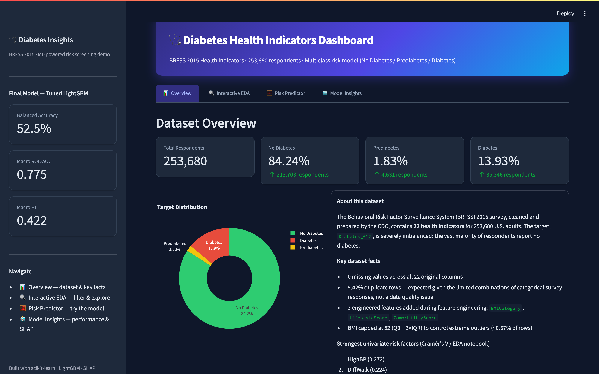
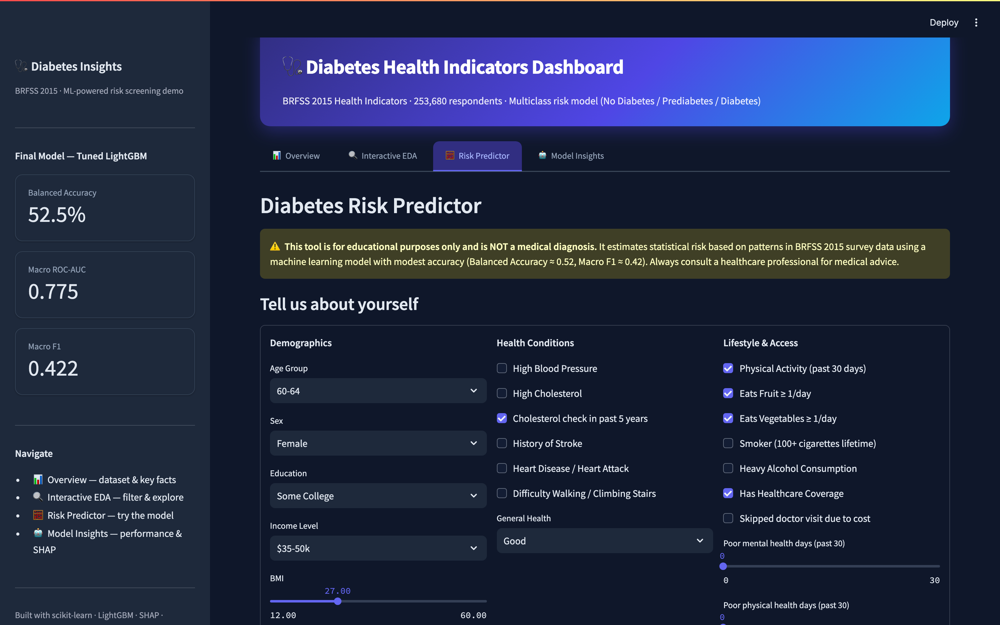

<h1 align="center">🩺 Diabetes Risk Dashboard</h1>

<p align="center">
  
  
  
  
  
</p>

<p align="center">
  Interactive Streamlit dashboard for screening diabetes risk — <b>No Diabetes / Prediabetes / Diabetes</b> —
  powered by a tuned LightGBM model trained on the BRFSS 2015 health indicators dataset (253,680 respondents).
</p>

<p align="center">
  🔗 <b>Live app:</b> <a href="https://bensoncyril123-diabetes-dashboard-dashboardapp-i5lrtb.streamlit.app/">bensoncyril123-diabetes-dashboard-dashboardapp-i5lrtb.streamlit.app</a>
</p>

---

## 🖼️ Preview

<p align="center">
  
  <br><em>Overview — dataset summary, target distribution, key risk factors</em>
</p>

<p align="center">
  
  <br><em>Risk Predictor — live diabetes-risk estimate from a short health & lifestyle form</em>
</p>

---

## Tabs

1. **📊 Overview** — dataset summary, target distribution, key risk factors, executive summary figure.
2. **🔍 Interactive EDA** — filter the population by age, sex, and BMI category; explore feature distributions and diabetes prevalence by group.
3. **🧮 Risk Predictor** — fill in a short health/lifestyle form to get a predicted diabetes-risk class with probability breakdown.
4. **🤖 Model Insights** — model comparison table, SHAP global feature importance, confusion matrix, and classification report for the final model.

> **Note:** this model is best used as a *screening aid* highlighting elevated-risk individuals for further evaluation — not a diagnostic tool.

## Running locally

```bash
pip install -r dashboard/requirements.txt
streamlit run dashboard/app.py
```

## Full Analysis

The EDA, feature engineering, and model training/tuning notebooks behind this dashboard live in the companion repo: [diabetes-risk-prediction](https://github.com/bensoncyril123/diabetes-risk-prediction).

## Tech Stack

`pandas` · `numpy` · `scikit-learn` · `LightGBM` · `Streamlit` · `Plotly`
